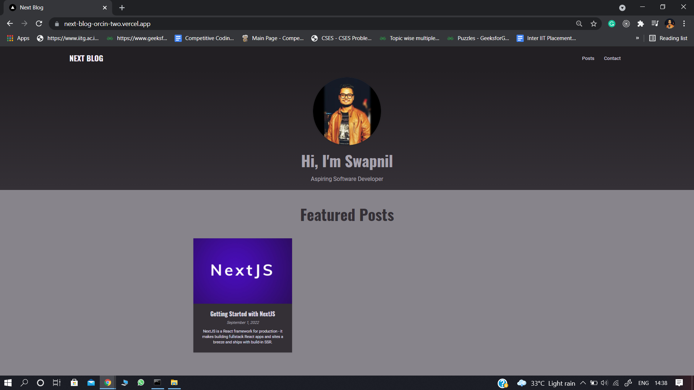
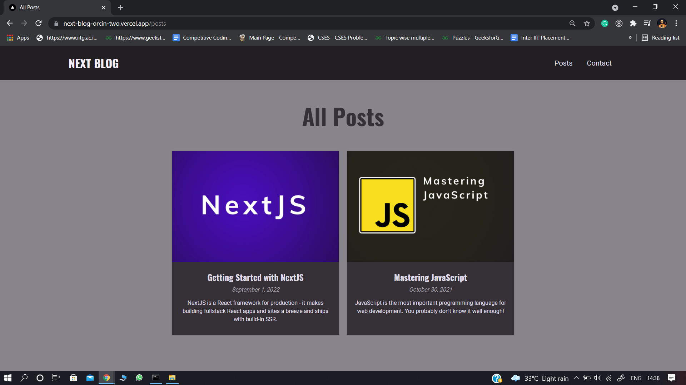
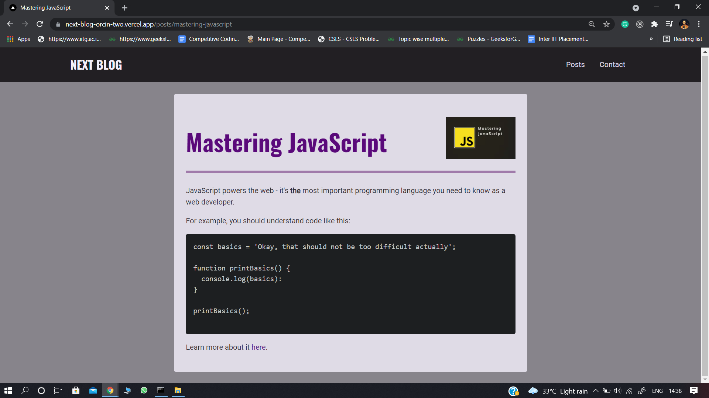
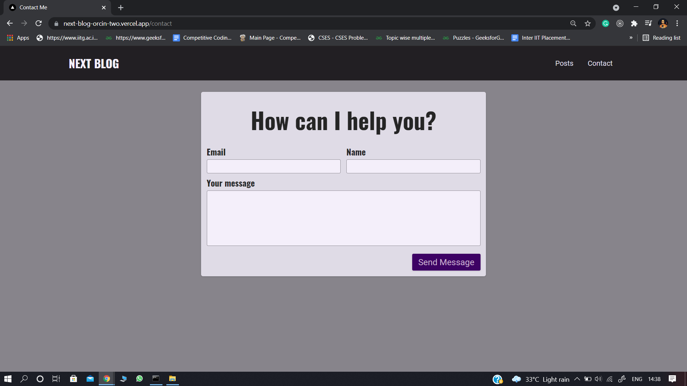

# Next Blog

Next.js Blog website, [click here](https://next-blog-orj2dr2px-swapnilhota.vercel.app/) to visit the website. 

### Tech-Stack
* Next.js used for building this website.
* MongoDB used as database.
* Used react-markdown package to convert markdown to JSX.
* Used gray-matter package which helps us to read markdown files and split it into
  metadata and the actual markdown content.
  
### Important Points
* lib folder contains utility functions.
* components prop of ReactMarkdown helps us to render markdown according to us.
* Content is written in markdown format.
* components folder contains the code of all the components used.

### Screenshots

1. Home Page

2. All Posts Page

3. Post Detail Page

4. Contact Page

